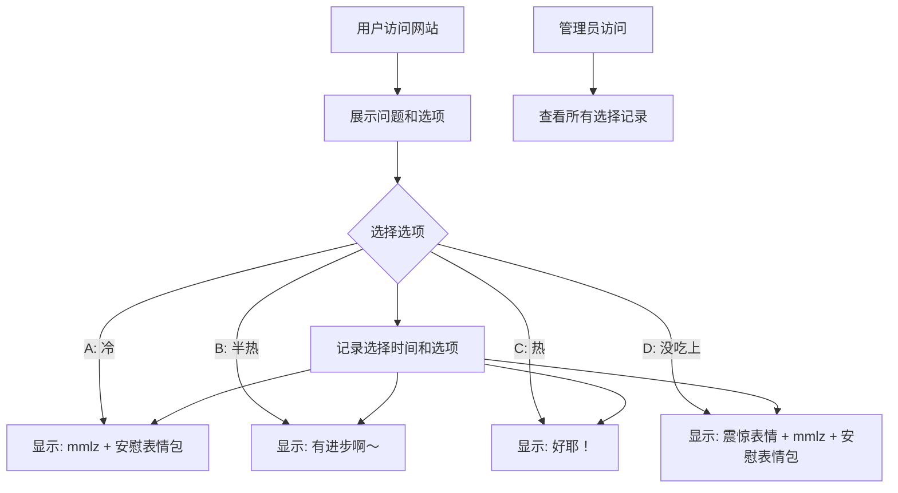

## 1. Product Overview
一个互动问答网站，用于收集朋友关于"今天的饭是热的吗"的反馈，并记录选择时间和选择情况供管理员查看。

## 2. Core Features

### 2.1 User Roles
| Role | Registration Method | Core Permissions |
|------|---------------------|------------------|
| User | 无需注册，直接访问 | 回答问题并查看结果 |
| Admin | 通过特定URL访问 | 查看所有用户的选择记录 |

### 2.2 Feature Module
1. **问答页面**: 展示问题和选项，用户选择后跳转结果
2. **结果页面**: 根据用户选择展示不同的反馈内容
3. **管理员页面**: 查看所有用户的选择时间和选择情况

### 2.3 Page Details
| Page Name | Module Name | Feature description |
|-----------|-------------|---------------------|
| 问答页面 | 问题展示 | 显示问题"今天的饭是热的吗"和四个选项A/B/C/D |
| 问答页面 | 选项交互 | 用户点击选项后记录数据并跳转结果页面 |
| 结果页面 | 结果展示 | 根据选择显示不同的反馈内容和表情包 |
| 管理员页面 | 记录列表 | 展示所有用户的选择记录，包含时间和选项 |

## 3. Core Process
用户访问网站 → 看到问题和选项 → 选择选项 → 跳转到结果页面 → 管理员通过特定URL查看所有记录

## 4. User Interface Design

### 4.1 Design Style
- Primary color: #FF6B6B (温暖的红色，适合美食主题)
- Secondary color: #FFE66D (明亮的黄色，增加活力)
- Button style: 圆角矩形，带阴影效果，悬停时有缩放动画
- Font: 可爱的手写风格字体，增加亲切感
- Layout style: 居中卡片式布局
- Icon/emoji style: 使用表情符号增强趣味性

### 4.2 Page Design Overview
| Page Name | Module Name | UI Elements |
|-----------|-------------|-------------|
| 问答页面 | 问题卡片 | 白色背景，圆角边框，居中展示问题 |
| 问答页面 | 选项按钮 | 四个选项按钮，A/B/C/D标记，悬停高亮 |
| 结果页面 | 结果卡片 | 根据选择显示不同内容和表情 |
| 结果页面 | 返回按钮 | 允许用户返回重新选择 |
| 管理员页面 | 记录列表 | 表格形式展示，包含时间、选项、IP等信息 |

### 4.3 Responsiveness
- 移动端优先设计
- 使用响应式布局适配不同屏幕尺寸
- 触摸友好的按钮尺寸

### 4.4 3D Scene Guidance
不适用，本项目为2D网页应用。