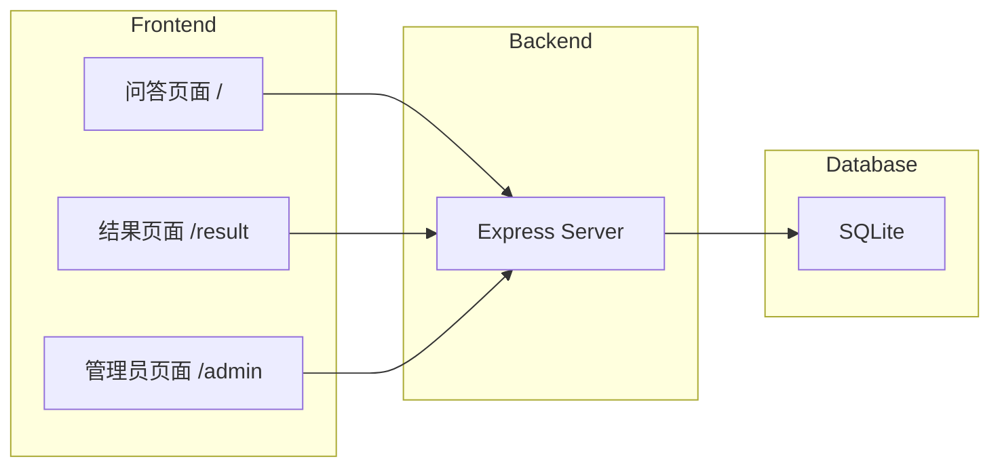
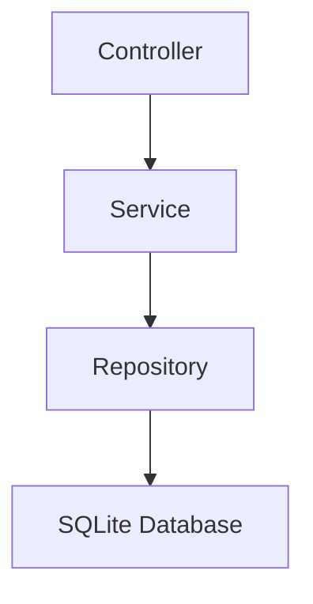
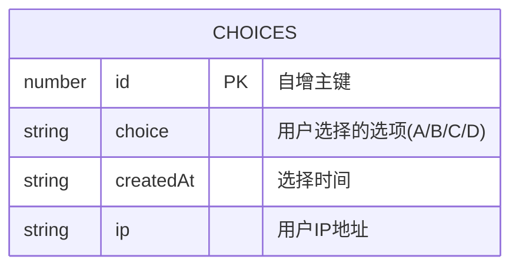

## 1. Architecture Design


## 2. Technology Description
- Frontend: React@18 + tailwindcss@3 + vite
- Initialization Tool: vite-init
- Backend: Express@4 + TypeScript
- Database: SQLite (轻量级，无需额外安装)

## 3. Route Definitions
| Route | Purpose |
|-------|---------|
| / | 问答页面，展示问题和选项 |
| /result | 结果页面，根据选择显示反馈 |
| /admin | 管理员页面，查看所有选择记录 |

## 4. API Definitions

### 4.1 POST /api/choices
记录用户的选择

**Request:**
```typescript
{
  choice: 'A' | 'B' | 'C' | 'D'
}
```

**Response:**
```typescript
{
  success: boolean
}
```

### 4.2 GET /api/choices
获取所有选择记录

**Response:**
```typescript
{
  choices: Array<{
    id: number
    choice: 'A' | 'B' | 'C' | 'D'
    createdAt: string
    ip: string
  }>
}
```

## 5. Server Architecture Diagram


## 6. Data Model

### 6.1 Data Model Definition


### 6.2 Data Definition Language
```sql
CREATE TABLE IF NOT EXISTS choices (
  id INTEGER PRIMARY KEY AUTOINCREMENT,
  choice TEXT NOT NULL CHECK(choice IN ('A', 'B', 'C', 'D')),
  createdAt TEXT NOT NULL,
  ip TEXT
);
```